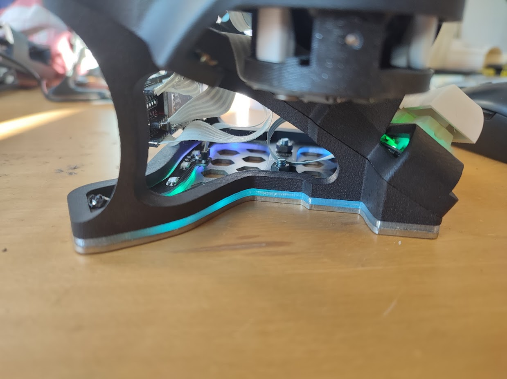

## Midglow plate

Charybdis Nano mod to add lights to the bottom plate when using the 30 degree organic tents.

## Required parts

### PCB

Order the PCB in 1mm thickness.
The gerber can be found in the releases section.

### Middle layer

The files are in the `mechanical` folder.

You have 2 options :

- print the STL in transparent PLA/PETG
- laser-cut an acrylic sheet (use the dxf)

### Bottom layer

Use the bottom plates for the tents from the Charybdis repo. Either 3d print or laser cut.

### Screws etc

The parts are for one side. If building a double Charybdis Nano, double the parts.

| Part name                                    | Amount |
| -------------------------------------------- | ------ |
| M4 8mm Torx Screw                            | 2      |
| M4 Nut                                       | 2      |
| PCB                                          | 1      |
| 3d printed or laser cut acrylic middle layer | 1      |
| 1206 resistor, 330 Ohms                      | 1      |
| 1206 capacitor, 1uF                          | 1      |
| SK6812 Mini_e led                            | 15     |

## License

This work is licensed under a Creative Commons Attribution-NonCommercial-ShareAlike 4.0 International License.
